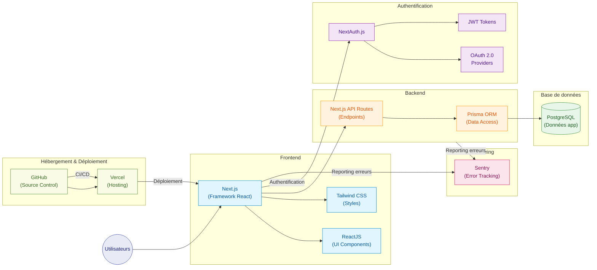
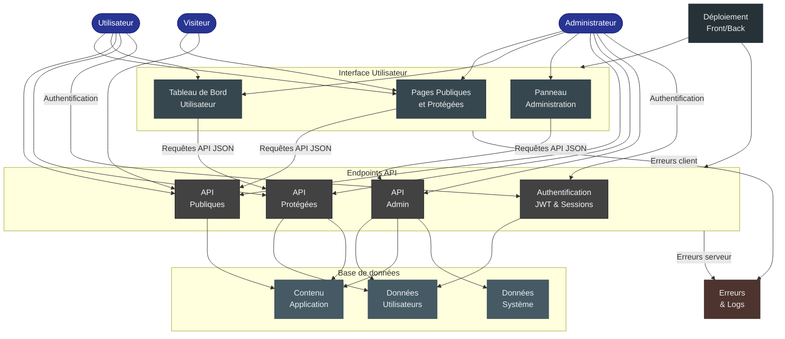

# Diagrammes d'Architecture et MCD pour CesiZen

Ce document présente trois diagrammes complémentaires pour CesiZen : une architecture technique détaillée, une architecture fonctionnelle conceptuelle et un modèle conceptuel de données.

## 1. Architecture Technique Détaillée (Version Claire)



## 2. Architecture Fonctionnelle Conceptuelle (Version Sombre)



## 3. Modèle Conceptuel de Données (MCD)

```mermaid
Flowchart td
    User {
        int id PK
        string name
        string email UK
        datetime emailVerified
        string image
        string password
        enum role
        datetime createdAt
        datetime updatedAt
        boolean isActive
        string resetToken
        datetime resetTokenExpires
    }
    
    Emotion {
        int id PK
        int userId FK
        int emotionId FK
        datetime date
        string comment
    }
    
    EmotionType {
        int id PK
        string name UK
        int level
        int parentId FK
        string color
        string bgColor
    }
    
    Activity {
        int id PK
        string title UK
        string description
        enum category
        string duration
        string level
        string location
        string equipment
        boolean isActive
        datetime createdAt
        datetime updatedAt
    }
    
    Favorite {
        int id PK
        int userId FK
        int activityId FK
        datetime createdAt
    }
    
    StressQuestion {
        int id PK
        string event UK
        int points
    }
    
    StressResult {
        int id PK
        int userId FK
        int totalScore
        datetime createdAt
    }
    
    PageContent {
        int id PK
        string page UK
        string title
        string content
        datetime updatedAt
    }
    
    User ||--o{ Favorite : "possède"
    User ||--o{ StressResult : "obtient"
    User ||--o{ Emotion : "enregistre"
    
    Activity ||--o{ Favorite : "est dans"
    
    EmotionType ||--o{ Emotion : "est de type"
    EmotionType ||--o{ EmotionType : "parent de"
```

Ces diagrammes offrent différentes vues de l'application CesiZen:
- Le premier diagramme présente la pile technologique détaillée avec tous les composants techniques.
- Le deuxième diagramme adopte une approche plus conceptuelle axée sur les rôles utilisateurs et les grandes fonctionnalités.
- Le troisième diagramme présente la structure de la base de données avec les entités et leurs relations.
