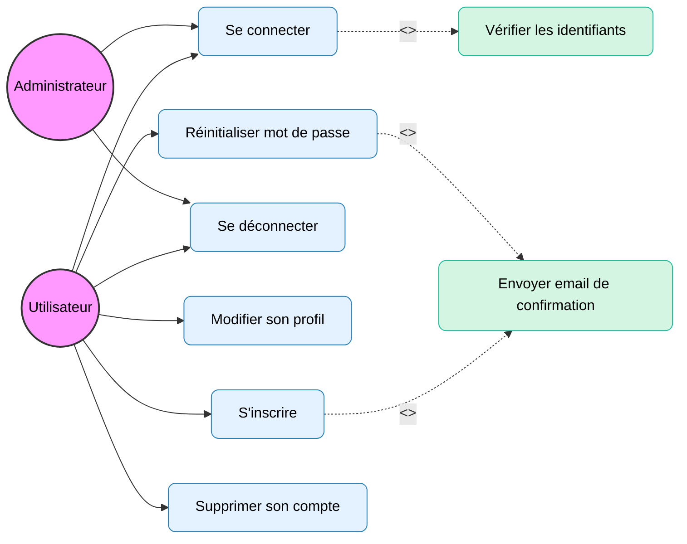
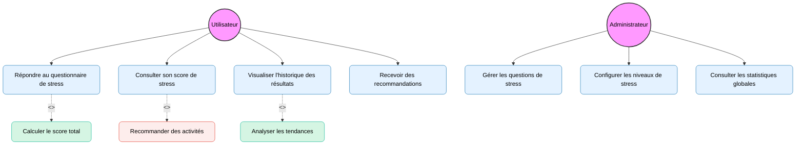
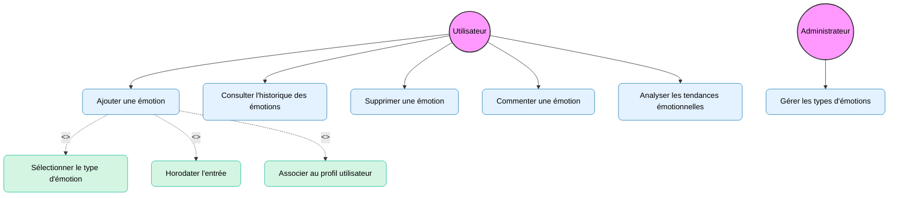
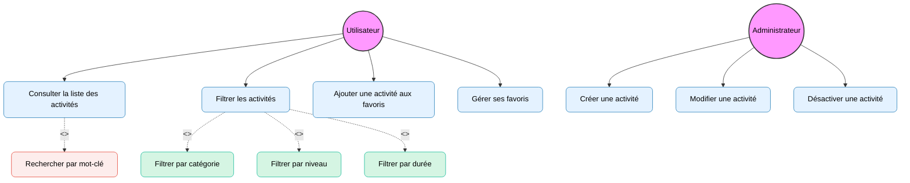
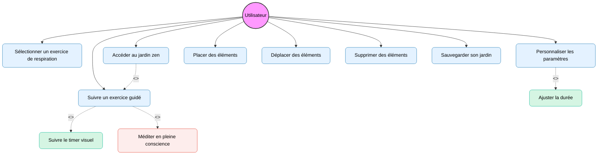
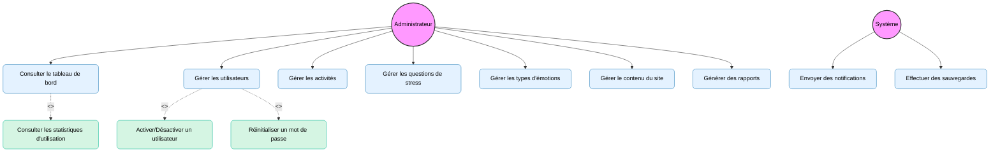

# Diagrammes de Cas d'Utilisation pour CesiZen

## Vue d'ensemble du système CesiZen

CesiZen est une application de gestion du stress et du bien-être mental qui offre aux utilisateurs plusieurs fonctionnalités:
- Gestion de profil utilisateur
- Test et suivi du niveau de stress
- Tracker d'émotions personnalisé
- Activités de bien-être et détente
- Exercices de respiration
- Jardin Zen interactif
- Administration et reporting

## Diagramme global des cas d'utilisation

```mermaid
flowchart TD
    %% Style des acteurs et cas d'utilisation
    classDef actor fill:#f9f,stroke:#333,stroke-width:2px,color:black
    classDef usecase fill:#e4f2ff,stroke:#2980b9,stroke-width:1px,rx:8px,ry:8px,color:black
    classDef include fill:#d5f5e3,stroke:#1abc9c,stroke-width:1px,rx:8px,ry:8px,color:black
    classDef extend fill:#fdedec,stroke:#e74c3c,stroke-width:1px,rx:8px,ry:8px,color:black

    %% Définition des acteurs
    User((Utilisateur)):::actor
    Admin((Administrateur)):::actor
    System((Système)):::actor
    
    %% Cas d'utilisation principaux
    UC1["S'authentifier"]:::usecase
    UC2[Gérer son profil]:::usecase
    UC3[Mesurer son niveau de stress]:::usecase
    UC4[Suivre ses émotions]:::usecase
    UC5[Consulter les activités]:::usecase
    UC6[Pratiquer des exercices de respiration]:::usecase
    UC7[Interagir avec le jardin zen]:::usecase
    UC8[Gérer les utilisateurs]:::usecase
    UC9[Administrer le contenu]:::usecase
    UC10[Analyser les statistiques]:::usecase
    UC11[Envoyer des notifications]:::usecase
    
    %% Relations utilisateur standard
    User --> UC1
    User --> UC2
    User --> UC3
    User --> UC4
    User --> UC5
    User --> UC6
    User --> UC7
    
    %% Relations administrateur
    Admin --> UC1
    Admin --> UC8
    Admin --> UC9
    Admin --> UC10
    
    %% Relation système
    System --> UC11
    
    %% Relations d'inclusion
    UC1 -.-> |<<include>>| UC1_1[Vérifier les identifiants]:::include
    UC3 -.-> |<<include>>| UC3_1[Calculer le score de stress]:::include
    UC5 -.-> |<<include>>| UC5_1[Filtrer les activités]:::include
    
    %% Relations d'extension
    UC5 -.-> |<<extend>>| UC5_2[Ajouter aux favoris]:::extend
    UC4 -.-> |<<extend>>| UC4_1[Ajouter un commentaire]:::extend
    UC7 -.-> |<<extend>>| UC7_1[Pratiquer la pleine conscience]:::extend
```

## Diagramme détaillé - Gestion du profil et authentification

## Diagramme détaillé - Gestion du stress

## Diagramme détaillé - Tracker d'émotions

## Diagramme détaillé - Gestion des activités

## Diagramme détaillé - Exercices de respiration et jardin zen

## Diagramme détaillé - Administration du système

## Légende et conventions

- **Acteur** : entité externe qui interagit avec le système (représenté par un cercle)
- **Cas d'utilisation** : fonctionnalité ou service offert par le système (représenté par une ellipse)
- **Relation simple** : indique qu'un acteur participe à un cas d'utilisation (ligne pleine)
- **Relation d'inclusion** : indique qu'un cas d'utilisation en inclut obligatoirement un autre (ligne pointillée avec <<include>>)
- **Relation d'extension** : indique qu'un cas d'utilisation peut en étendre un autre sous certaines conditions (ligne pointillée avec <<extend>>)

## Couleurs utilisées

- **Acteurs** : fond rose
- **Cas d'utilisation standard** : fond bleu clair
- **Cas d'inclusion** : fond vert clair
- **Cas d'extension** : fond rouge clair
