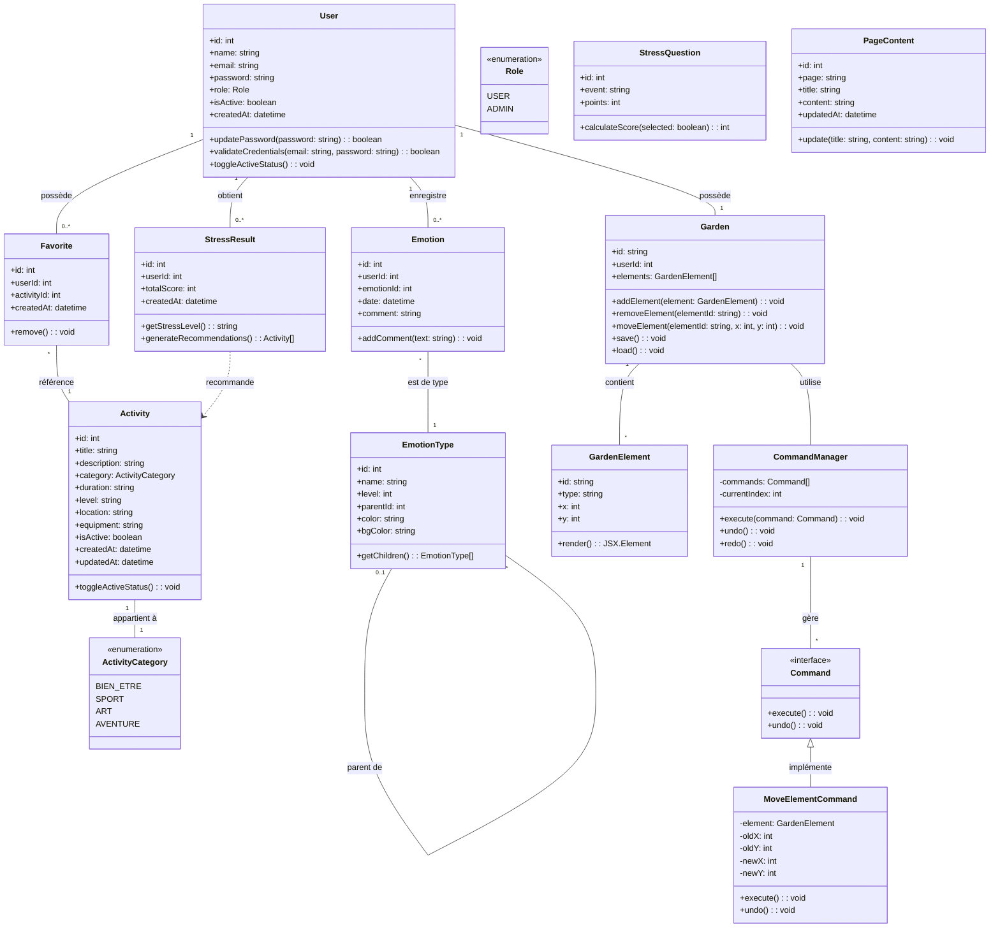
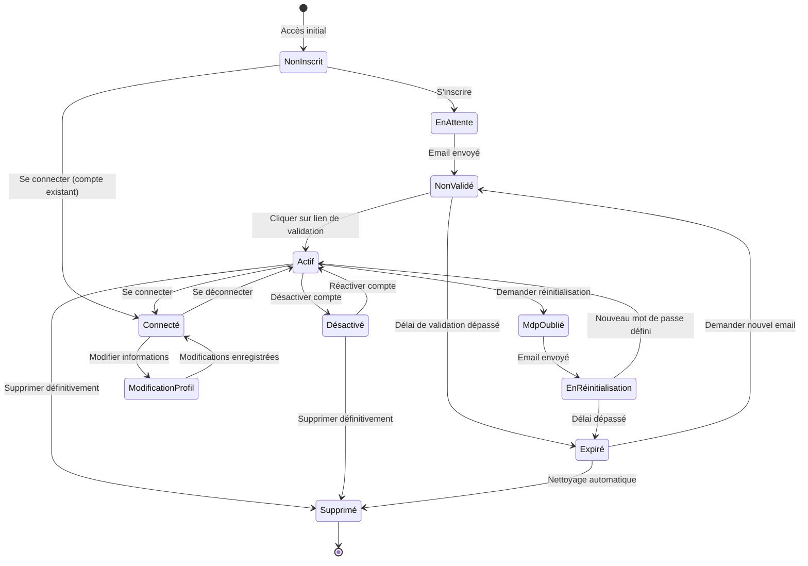
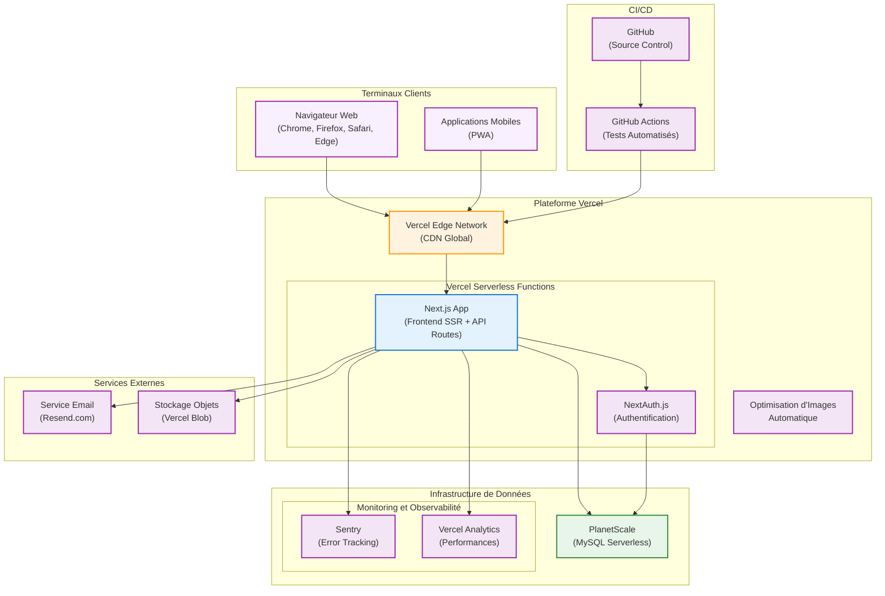

# Diagrammes Complémentaires pour CesiZen

Ce document présente quatre diagrammes complémentaires pour l'application CesiZen : un diagramme de classes, un diagramme d'états, un diagramme de déploiement et un diagramme d'activité.

## 1. Diagramme de Classes

Ce diagramme montre les principales classes de l'application CesiZen et leurs relations.



## 2. Diagramme d'États - Compte Utilisateur

Ce diagramme illustre les différents états possibles pour un compte utilisateur CesiZen.



## 3. Diagramme de Déploiement

Ce diagramme détaille l'infrastructure physique de déploiement de l'application CesiZen.



## 4. Diagramme d'Activité - Processus d'Évaluation du Stress

Ce diagramme illustre le processus d'évaluation du niveau de stress et de recommandation d'activités.

```mermaid
flowchart TB
    %% Styles
    classDef start fill:#d1c4e9,stroke:#673ab7,stroke-width:2px
    classDef process fill:#e1bee7,stroke:#8e24aa,stroke-width:1px
    classDef decision fill:#f3e5f5,stroke:#9c27b0,stroke-width:1px,shape:diamond
    classDef ending fill:#ede7f6,stroke:#673ab7,stroke-width:2px

    %% Phases du processus
    start((Début)):::start --> AccessTest[Utilisateur accède au test de stress]:::process
    AccessTest --> LoadQuestions[Chargement des questions de stress]:::process
    LoadQuestions --> DisplayQuestionnaire[Affichage du questionnaire]:::process
    
    DisplayQuestionnaire --> SelectEvents[Utilisateur sélectionne les événements vécus]:::process
    SelectEvents --> NoEvents{Événements sélectionnés?}:::decision
    
    NoEvents -- Non --> DisplayError[Afficher message d'erreur]:::process
    DisplayError --> DisplayQuestionnaire
    
    NoEvents -- Oui --> CalculateScore[Calcul du score total]:::process
    CalculateScore --> SaveResults[Enregistrement du résultat]:::process
    
    SaveResults --> IsUserAuthenticated{Utilisateur connecté?}:::decision
    IsUserAuthenticated -- Oui --> AssociateWithUser[Association au profil utilisateur]:::process
    IsUserAuthenticated -- Non --> AnonymousResult[Résultat anonyme]:::process
    
    AssociateWithUser --> DetermineLevel[Détermination du niveau de stress]:::process
    AnonymousResult --> DetermineLevel
    
    DetermineLevel --> StressLevel{Niveau de stress}:::decision
    StressLevel -- "Faible\n(<150)" --> LowStressRecommendations[Recommandations légères]:::process
    StressLevel -- "Modéré\n(150-300)" --> MediumStressRecommendations[Recommandations modérées]:::process
    StressLevel -- "Élevé\n(>300)" --> HighStressRecommendations[Recommandations intensives]:::process
    
    LowStressRecommendations --> FindRelatedActivities[Recherche d'activités adaptées]:::process
    MediumStressRecommendations --> FindRelatedActivities
    HighStressRecommendations --> FindRelatedActivities
    
    FindRelatedActivities --> DisplayResults[Affichage des résultats et recommandations]:::process
    
    DisplayResults --> ViewHistory{Voir historique?}:::decision    ViewHistory -- Oui --> IsUserAuthenticated2{Utilisateur connecté?}:::decision
    ViewHistory -- Non --> end1((Fin)):::ending
    
    IsUserAuthenticated2 -- Non --> LoginPrompt[Inviter à se connecter]:::process
    IsUserAuthenticated2 -- Oui --> LoadHistory[Chargement de l'historique]:::process
    
    LoginPrompt --> end1
    LoadHistory --> AnalyzeTrends[Analyse des tendances]:::process
    AnalyzeTrends --> DisplayTrends[Affichage des graphiques de tendance]:::process
    DisplayTrends --> end1
```

Ces diagrammes complètent la documentation technique de CesiZen en présentant différentes vues du système : la structure des classes et leurs relations, les états possibles d'un compte utilisateur, l'infrastructure de déploiement et le processus métier d'évaluation du stress.
