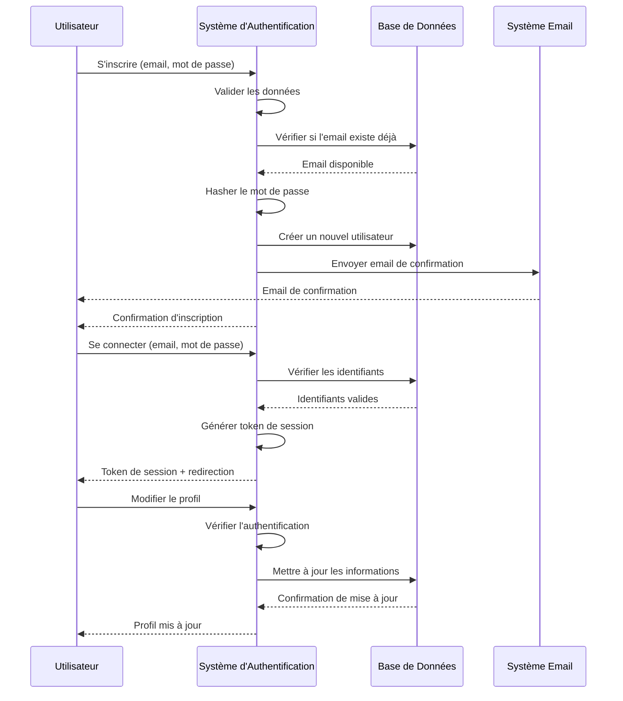
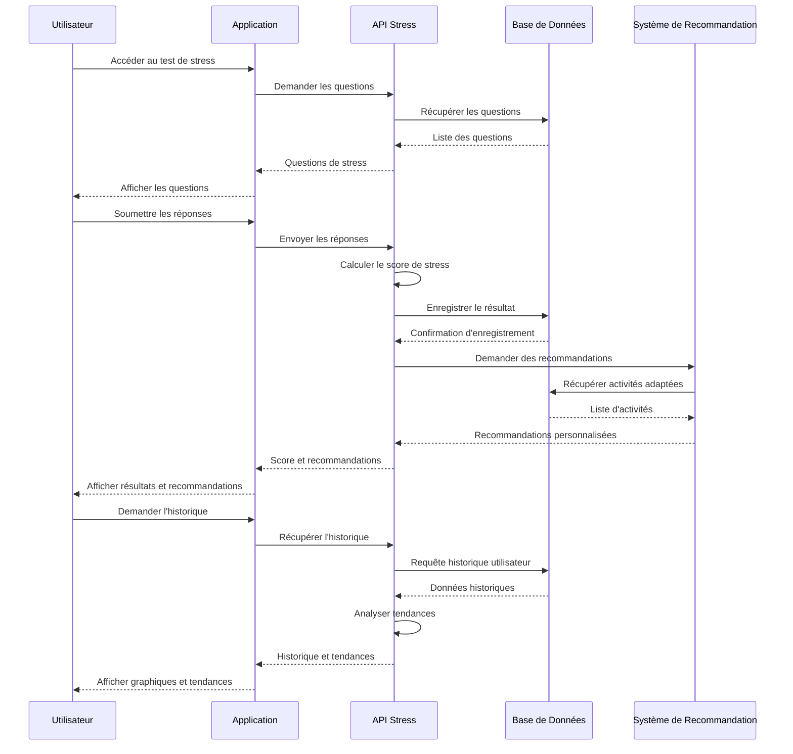
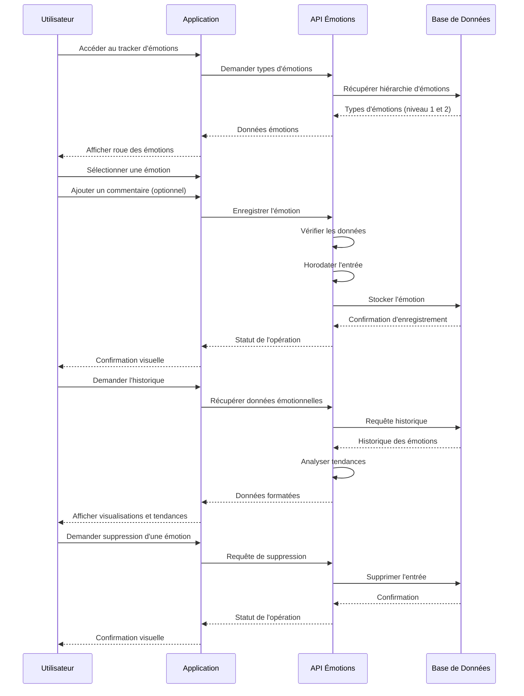
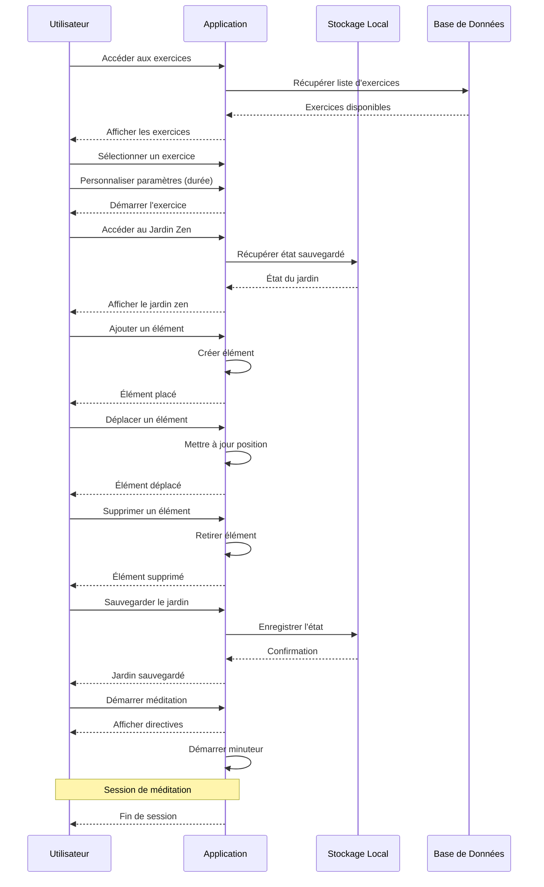

# Diagrammes de Séquence pour CesiZen

Ce document présente les diagrammes de séquence pour les principales fonctionnalités de l'application CesiZen. Ces diagrammes montrent les interactions chronologiques entre les acteurs et le système.

## 1. Diagramme de séquence - Authentification et gestion de profil

## 2. Diagramme de séquence - Test de stress et recommandations

## 3. Diagramme de séquence - Tracker d'émotions

## 4. Diagramme de séquence - Jardin Zen et exercices de respiration

Chaque diagramme montre clairement la séquence chronologique des interactions entre les différents acteurs et composants du système, mettant en évidence le flux de données et le comportement attendu pour chaque fonctionnalité principale de CesiZen.
