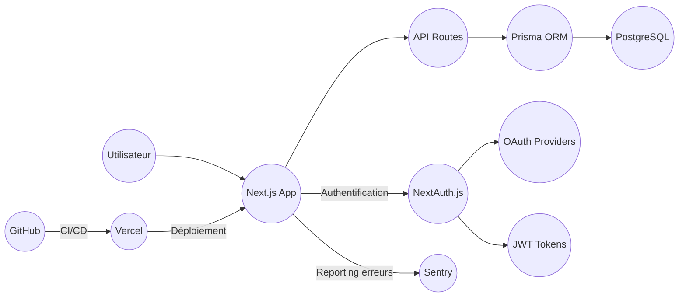

# Guide d'entretien technique Next.js – Projet Cesizen

## 0. Vue d'ensemble du projet

CesiZen est une application web de gestion du stress et du bien-être mental. Elle propose :
- Un suivi du stress et des émotions
- Des exercices de respiration
- Un jardin zen interactif (drag & drop, animations)
- Un espace personnel sécurisé (dashboard, profil)
- Un système d’authentification sécurisé (NextAuth, JWT, OAuth)
- Un backoffice admin

> **Allégorie** : CesiZen, c’est comme un centre de bien-être numérique où chaque utilisateur a son espace personnel, ses outils de relaxation, et où la sécurité est assurée par des gardiens (middleware, protections).

## 1. Architecture technique

L’architecture repose sur Next.js (React), Prisma (ORM), PostgreSQL (DB), NextAuth (auth), Vercel (hébergement), Sentry (monitoring).



> **Allégorie** :
> - Next.js, c’est la réception et les salles d’activité du centre.
> - NextAuth, c’est le service d’accueil qui vérifie l’identité.
> - Prisma, c’est le standard téléphonique qui communique avec la base de données.
> - Vercel, c’est le gestionnaire du bâtiment qui déploie les nouveautés.
> - Sentry, c’est le système d’alarme qui prévient en cas de problème.

## 2. Explication des modules et fichiers principaux

### Backend & logique métier
- `middleware.ts` :
  - Ajoute des headers de sécurité (CSP, HSTS, etc.)
  - Vérifie l’authentification (next-auth)
  - Applique le rate limiting (lib/rateLimiter)
  - **Allégorie** : Le videur du centre, qui vérifie chaque visiteur et applique les règles.
- `lib/rateLimiter.ts`, `lib/bruteForceProtector.ts` :
  - Limitation des abus (trop de requêtes, tentatives de connexion)
  - **Allégorie** : Le compteur à l’entrée et le garde qui repère les tricheurs.
- `lib/prisma.ts` :
  - Connexion à la base PostgreSQL via Prisma
  - **Allégorie** : Le standard téléphonique du centre.
- `prisma/seed.ts`, `seed.cjs` :
  - Scripts pour remplir la base avec des données de test
- `lib/authOptions.ts` :
  - Configuration NextAuth (providers, callbacks, pages custom)
  - **Allégorie** : Le service d’accueil qui remet les badges d’accès.
- `security/` :
  - Protections avancées (CORS, CSRF, input validation, logs, tests)
  - **Allégorie** : Les caméras, alarmes et protocoles de sécurité du centre.
- `docs/SECURITY_PROTECTION.md`, `security/SECURITY_EDUCATION.md` :
  - Guides pédagogiques sur les menaces et défenses

### Frontend & composants React
- `ZenGarden` : Composant principal du jardin zen (état, interactions, animation)
- `Hero`, `AnimatedCard`, `Interactive*` : Accueil, animations, interactions utilisateur
- `AmbientSound` : Musique d’ambiance
- `Step`, `ZenDeco`, `WideCheminSinueux` : Décorations interactives
- **Allégorie** : Les pièces et décors du centre de bien-être.

### Command Pattern (Undo/Redo dans le jardin zen)
- `Command` (interface) : chaque action (ajout, déplacement, suppression d’élément) est une commande.
- `CommandManager` : gère l’historique des commandes pour permettre undo/redo (comme CTRL+Z/CTRL+Y dans un éditeur).
- `Garden`, `GardenElement`, `Stone`, `Bonsai`, `Lantern`, `Pond` : éléments du jardin zen.
- `GardenElementFactory` : fabrique les bons objets selon le type demandé.
- **Allégorie** : Le carnet de bord où chaque action est notée.

### Authentification (NextAuth, JWT, OAuth)
- `lib/authOptions.ts` : configuration des providers (email, OAuth), callbacks, pages customisées.
- JWT : token sécurisé pour chaque utilisateur connecté.
- OAuth : connexion possible via Google, etc.
- **Allégorie** : Le badge d’accès personnalisé remis à chaque visiteur.

### Base de données (Prisma, PostgreSQL)
- `lib/prisma.ts` : connexion à la base via Prisma.
- `prisma/seed.ts`, `seed.cjs` : scripts pour remplir la base avec des données de test.
- **Allégorie** : Le coffre-fort où sont stockées toutes les informations des membres.

### CI/CD & déploiement (GitHub, Vercel)
- `plan_maintenance_cesizen.md`, `presentation_cycle_vie_logiciel.md` : documentation sur le pipeline DevOps.
- `package.json` : scripts de build, test, déploiement.
- `docker-compose.yml` : configuration des services pour le développement/test.
- **Allégorie** : La chaîne de montage et de livraison automatique des nouveautés dans le centre.

### Monitoring & gestion des incidents
- Sentry : collecte les erreurs et les incidents.
- Vercel Analytics : surveille la performance.
- Jira : gestion des tickets et incidents.
- **Allégorie** : Le tableau de bord de contrôle du centre, avec alarmes et rapports en temps réel.

### Scripts utilitaires
- `hashPassword.js`, `createAdmin.js` : gestion des mots de passe et des comptes admin.
- `convert_md_to_docx.py`, `merge_pdfs.py` : outils pour la documentation.
- **Allégorie** : Les outils de maintenance et de gestion du centre.

---

## 3. Fonctionnement technique Next.js et concepts clés

- **SSR (Server Side Rendering)** : génération de pages côté serveur à chaque requête
- **SSG (Static Site Generation)** : génération de pages statiques au build
- **CSR (Client Side Rendering)** : rendu classique React côté navigateur
- **API Routes** : endpoints backend dans `/pages/api` ou `/app/api`
- **Routing basé sur les fichiers** : chaque fichier dans `/pages` ou `/app` devient une route
- **Server Components** : exécutés sur le serveur, pas de JS envoyé au client
- **Client Components** : exécutés dans le navigateur, interactivité, hooks React

---

## 4. Fonctionnement technique des modules principaux

### 🌬️ Module Respiration (`app/respiration/page.tsx`)

- **Gestion de l’état et des phases**  
  Utilise `useState` pour suivre l’exercice sélectionné, la phase (inspiration, pause, expiration), le temps restant, et si l’animation est en cours.
  ```typescript
  const [selectedExercise, setSelectedExercise] = useState(exercises[0]);
  const [phase, setPhase] = useState("inhale");
  const [timeLeft, setTimeLeft] = useState(selectedExercise.inhale);
  const [isRunning, setIsRunning] = useState(false);
  ```
- **Synchronisation des phases**  
  Utilise `useEffect` pour lancer et synchroniser le timer à chaque changement de phase ou d’exercice.
  ```typescript
  useEffect(() => {
    // timer et gestion des transitions entre phases
  }, [phase, isRunning, selectedExercise]);
  ```
- **Animation**  
  Utilise Framer Motion pour animer le cercle de respiration selon la phase.
  ```typescript
  import { motion } from "framer-motion";
  // <motion.circle ... /> animé selon la phase
  ```
- **Interaction utilisateur**  
  L’utilisateur choisit un exercice (menu ou boutons), lance l’animation, et suit le rythme visuel et le compte à rebours. Les phases s’enchaînent automatiquement.

---

### 🧠 Module Stress (`app/stress/page.tsx`)

- **Gestion de l’état**  
  Utilise `useState` pour stocker les questions, les réponses, le score, l’étape courante, etc.
  ```typescript
  const [questions, setQuestions] = useState<Question[]>([]);
  const [selectedEvents, setSelectedEvents] = useState<number[]>([]);
  const [score, setScore] = useState<number | null>(null);
  const [currentStep, setCurrentStep] = useState(1);
  ```
- **Chargement des questions**  
  Récupère les questions via une API avec `fetch` ou `getServerSideProps`.
  ```typescript
  fetch("/api/stress/questions")
  ```
- **Soumission des réponses**  
  Envoie les réponses au serveur pour calcul du score.
  ```typescript
  const response = await fetch("/api/stress/submit", {
    method: "POST",
    body: JSON.stringify({ ... }),
  });
  ```
- **Affichage du résultat**  
  Le score et le niveau de stress sont affichés avec un message personnalisé.

---

### 📈 Module Tracker d'émotions (`app/tracker/page.tsx`)

- **Gestion de l’état**  
  Utilise `useState` et `useEffect` pour charger et stocker les émotions, les types d’émotions, etc.
  ```typescript
  useEffect(() => {
    fetchEmotions();
    fetchEmotionTypes();
  }, []);
  ```
- **Appels API**  
  Récupère et enregistre les émotions via des endpoints dédiés.
  ```typescript
  const fetchEmotions = async () => {
    const res = await fetch("/api/tracker/emotions");
    ...
  }
  const fetchEmotionTypes = async () => {
    const res = await fetch("/api/emotions/all");
    ...
  }
  const response = await fetch("/api/tracker/emotions", { method: "POST", ... });
  const response = await fetch(`/api/tracker/emotions/${emotionId}`, { method: "DELETE", ... });
  ```
- **Affichage**  
  Les émotions sont groupées par date et affichées dans une timeline, des cards ou une liste. Ajout, suppression, commentaire via les API.

---

### 🧘 Module Activités (`app/activities/page.tsx`)

- **Gestion de l’état**  
  Utilise `useState` pour stocker les activités, les favoris, les filtres, etc.
  ```typescript
  const [activities, setActivities] = useState<Activity[]>([]);
  const [favorites, setFavorites] = useState<Favorite[]>([]);
  const [searchTerm, setSearchTerm] = useState<string>("");
  const [categoryFilter, setCategoryFilter] = useState<string>("");
  ```
- **Chargement et gestion des activités**  
  Récupère les activités et les favoris via API.
  ```typescript
  const fetchActivities = async () => {
    const response = await fetch("/api/activities");
    ...
  }
  const fetchFavorites = async () => {
    const response = await fetch("/api/activities/favorites");
    ...
  }
  ```
- **Ajout/retrait des favoris**  
  ```typescript
  const response = await fetch("/api/activities/favorites", { method: "POST", ... });
  const response = await fetch("/api/activities/favorites", { method: "DELETE", ... });
  ```
- **Affichage**  
  Utilisation de composants pour la liste, les favoris, le détail (page dynamique `[id]/page.tsx`).

---

### 🪴 Module Jardin Zen (`app/zenGarden/page.tsx`, `components/ZenGarden.tsx`)

- **Pattern Command (Undo/Redo)**  
  Utilise un `CommandManager` pour encapsuler chaque action (ajout, déplacement, suppression) dans un objet Command avec `execute` et `undo`.
  ```typescript
  import { CommandManager } from '../classes/CommandManager';
  const commandManagerRef = useRef(new CommandManager());
  commandManagerRef.current.executeCommand(addCommand);
  commandManagerRef.current.undo();
  commandManagerRef.current.redo();
  ```
- **Drag & Drop**  
  Permet de glisser-déposer des éléments sur le canevas (drag & drop natif ou via une lib comme react-dnd).
  ```typescript
  const handleDrop = (event: React.DragEvent<HTMLDivElement>) => { ... }
  const handleDragOver = (event: React.DragEvent<HTMLDivElement>) => { ... }
  ```
- **Gestion des éléments**  
  Les éléments du jardin sont stockés dans un state (tableau d’objets avec type, position, etc.), chaque modification passe par le CommandManager.
- **Animation et ambiance**  
  Utilise Lottie pour l’animation de vent.
  ```typescript
  import Lottie from 'lottie-react';
  // <Lottie {...windAnimationOptions} />
  ```
- **Undo/Redo**  
  Boutons ou raccourcis clavier qui appellent les méthodes du CommandManager.

---

**Résumé** :  
- Tous les modules reposent sur `useState` et `useEffect` pour la gestion de l’état et des effets.
- Les interactions avec le backend se font via des appels API (fetch, POST, DELETE, etc.).
- Les modules intègrent des patterns avancés (Command, drag & drop, animation) pour l’expérience utilisateur et la maintenabilité du code.

---

## 5. Exemples de questions/réponses pour l'entretien

### Q : À quoi sert le middleware dans ce projet ?
R : Il protège les routes sensibles, ajoute des headers de sécurité, et limite le nombre de requêtes sur les APIs.

> **Allégorie** : Le middleware, c'est comme le videur d'une boîte de nuit. Il vérifie l'identité, refuse l'entrée aux fauteurs de troubles, et s'assure que tout le monde respecte les règles de sécurité.

### Q : Quelle différence entre une API route et une page React ?
R : L'API route est exécutée côté serveur (Node.js), la page React côté client (navigateur).

> **Allégorie** : L'API route, c'est la cuisine d'un restaurant (invisible pour le client), la page React, c'est la salle où le client interagit avec le plat.

### Q : Comment Next.js gère-t-il le SSR et le SSG ?
R : SSR génère la page à chaque requête, SSG la génère au build. Le choix dépend du besoin de fraîcheur des données.

> **Allégorie** : SSR, c'est le chef qui prépare chaque plat à la commande. SSG, c'est le buffet préparé à l'avance.

### Q : Pourquoi utiliser des Server Components ?
R : Pour la sécurité (pas de code exposé au client) et la performance (moins de JS à charger).

> **Allégorie** : Les Server Components, c'est la cuisine fermée d'un restaurant : le client ne voit rien, tout est préparé en coulisse.

### Q : Comment est gérée l'authentification ?
R : Avec `next-auth`, le middleware vérifie la présence d'un token pour accéder aux routes protégées.

> **Allégorie** : Le token, c'est le bracelet d'accès VIP : sans lui, impossible d'entrer dans les zones réservées.

### Q : Qu'est-ce que le rate limiting et pourquoi l'utiliser ?
R : C'est une protection qui limite le nombre de requêtes d'un utilisateur sur une période donnée pour éviter les abus (DoS, brute force).

> **Allégorie** : Comme un compteur à l'entrée d'un magasin qui limite le nombre de clients pour éviter la surpopulation.

### Q : Comment fonctionne le CI/CD dans ce projet ?
R : À chaque push, GitHub Actions vérifie, teste, construit et déploie automatiquement le projet sur Vercel.

> **Allégorie** : C'est une chaîne de montage automatisée qui contrôle la qualité et livre le produit fini sans intervention humaine.

### Q : Comment le monitoring est-il assuré ?
R : Sentry collecte les erreurs, Vercel Analytics surveille la performance, Jira suit les incidents.

> **Allégorie** : C'est le tableau de bord d'une voiture : tu vois en temps réel les alertes et l'état du système.

### Q : Qu'est-ce qu'un header de sécurité et à quoi ça sert ?
R : Ce sont des instructions envoyées au navigateur pour renforcer la sécurité (CSP, HSTS, X-Frame-Options, etc.).

> **Allégorie** : Les headers de sécurité, ce sont les consignes affichées à l'entrée d'un bâtiment (interdiction de fumer, port du casque, etc.).

### Q : Quelle différence entre Client Component et Server Component ?
R : Les Server Components s'exécutent sur le serveur (pas de JS côté client), les Client Components s'exécutent dans le navigateur (interactivité, hooks React).

> **Allégorie** : Le Server Component, c'est le chef en cuisine ; le Client Component, c'est le serveur qui interagit avec le client en salle.

---

N'hésite pas à compléter ce document avec des exemples de code, des schémas ou des cas d'usage spécifiques à ton expérience sur le projet.
